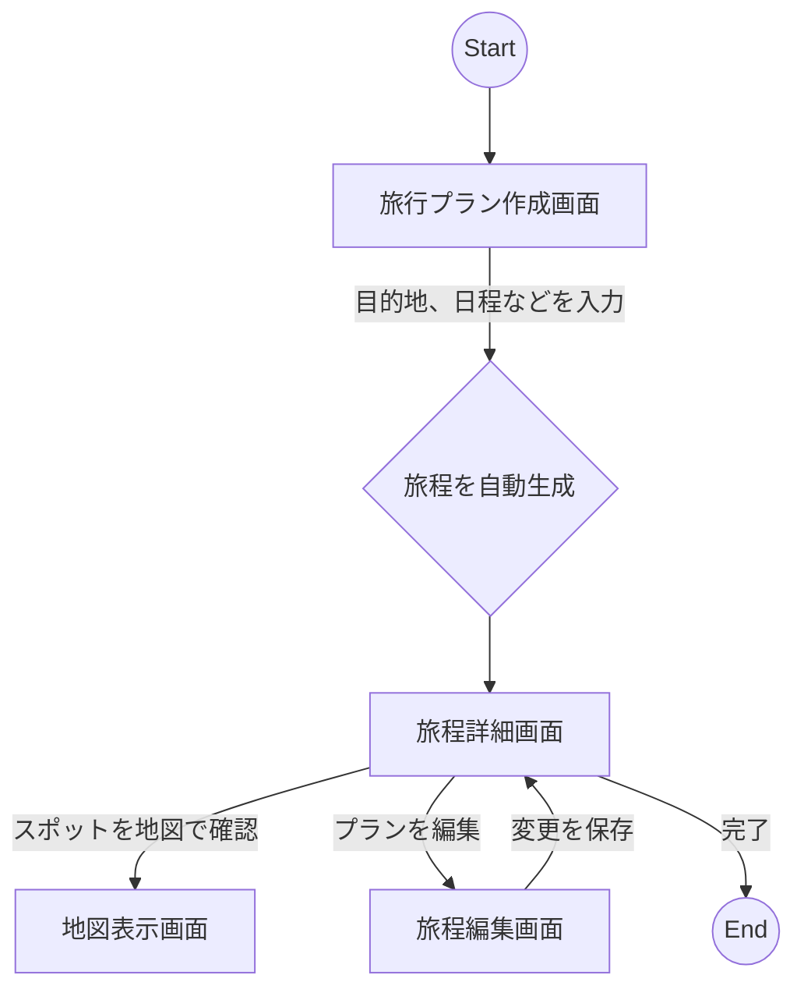

# `trip_planner` アプリ設計書

## 1. 概要

このドキュメントは、Flutterで開発する旅行計画アプリ `trip_planner` の設計について記述するものです。
ユーザーが目的地、日程、興味などの条件を入力すると、おすすめの旅行プラン（旅のしおり）を自動で作成してくれるアプリを目指します。

## 2. 目的と問題の詳細な分析

### 解決したい問題

多くの人が旅行を計画する際、行き先の情報収集、スケジュールの管理、予算の計算などに多くの時間と労力を費やしています。情報はネット上に散在しており、それらをまとめて一つの計画にするのは面倒な作業です。

### アプリのゴール

このアプリは、旅行計画のプロセスをシンプルにし、誰でも簡単に楽しく旅行の準備ができるようにすることを目的とします。ユーザーはいくつかの簡単な情報を入力するだけで、パーソナライズされた旅行プランを手に入れることができます。

### 主な機能

*   **旅行プラン作成:** 目的地、日程、人数などを入力して、新しい旅行プランを作成する。
*   **興味・関心の入力:** 「グルメ」「歴史」「自然」「アート」など、ユーザーの興味を選択できる。
*   **旅程の自動生成:** 入力された情報に基づいて、おすすめのスポットや移動時間を含んだ旅程を自動で生成する。
*   **旅程の確認と編集:** 生成された旅程を確認し、不要なスポットを削除したり、新しいスポットを追加したりできる。
*   **地図表示:** 旅程に含まれるスポットを地図上で確認できる。

## 3. 検討された代替案

### アーキテクチャ

*   **クリーンアーキテクチャ:**
    *   メリット: 依存関係が明確で、大規模開発や長期的なメンテナンス性に優れる。
    *   デメリット: 構造が複雑になりがちで、小〜中規模のアプリではオーバースペックになる可能性がある。初期の開発速度が遅くなる懸念がある。
*   **単純なState Management (`setState`):**
    *   メリット: Flutterの基本的な機能であり、学習コストが低い。
    *   デメリット: アプリの状態が複雑になるにつれて、状態の管理が困難になり、コードの見通しが悪くなる。スケールしない。

### 採用するアーキテクチャ

**MVVM (Model-View-ViewModel) + Repositoryパターン** を採用します。
UI（View）、UIの状態とロジック（ViewModel）、データ（Model）を分離することで、見通しが良く、テストしやすいコードを目指します。また、データ層を抽象化するRepositoryパターンを組み合わせることで、将来的なデータソースの変更（例: APIの差し替え、ローカルDBの導入）に柔軟に対応できるようにします。
開発速度とメンテナンス性のバランスが取れており、今回のアプリ規模に最適だと判断しました。

## 4. 詳細な設計

### アーキテクチャ図

```mermaid
graph TD
    subgraph Presentation Layer
        A[View (Widgets)] -- User Events --> B(ViewModel);
        B -- State Updates --> A;
    end

    subgraph Domain Layer
        B -- Calls Methods --> C{Repository (Interface)};
    end

    subgraph Data Layer
        C -- Implemented by --> D[Repository Impl];
        D -- Fetches/Saves Data --> E[Remote Data Source (API)];
        D -- Fetches/Saves Data --> F[Local Data Source (DB/Cache)];
    end

    style A fill:#c9f,stroke:#333,stroke-width:2px
    style B fill:#9cf,stroke:#333,stroke-width:2px
    style C fill:#9fc,stroke:#333,stroke-width:2px
    style D fill:#9fc,stroke:#333,stroke-width:2px
    style E fill:#f99,stroke:#333,stroke-width:2px
    style F fill:#f99,stroke:#333,stroke-width:2px
```

### ユーザーフロー図



### 状態管理

`ChangeNotifier` と `ListenableBuilder` を使用します。
各画面に対応する `ViewModel` が `ChangeNotifier` を継承し、UIの状態（入力データ、ローディング状態など）を管理します。UIは `ListenableBuilder` を使って `ViewModel` の変更を監視し、必要な部分だけを効率的に再描画します。

### ナビゲーション

`go_router` パッケージを採用します。
宣言的なルーティングにより、画面遷移の管理がシンプルになります。Web対応やディープリンクも視野に入れることができます。

### データ層

*   **モデル:**
    *   `Trip`: 旅行プラン全体を表すクラス（目的地、開始日、終了日など）。
    *   `Itinerary`: 1日ごとの旅程を表すクラス。
    *   `Activity`: 個々のアクティビティやスポットを表すクラス（名前、場所、時間など）。
*   **データ永続化:**
    *   **リモート:** 初期段階では、観光スポット情報などを取得するためのAPIはモック（ダミーのデータ）を使用します。将来的には実際のWeb APIに接続します。
    *   **ローカル:** 作成した旅行プランをオフラインでも見れるように、`hive` や `sqflite` などのローカルデータベースに保存することを検討します。
*   **JSONシリアライズ:**
    *   APIとの通信やローカル保存のために、`json_serializable` パッケージを使用して、DartオブジェクトとJSONを相互に変換します。

### ディレクトリ構成

機能ごとにファイルをまとめる「Feature-First」構成を採用します。

```
lib/
├── main.dart
├── core/                     # アプリ共通の機能
│   ├── app_theme.dart        # テーマ設定
│   └── routing/
│       └── app_router.dart   # ナビゲーション設定
├── data/                     # データ層
│   ├── models/               # データモデル
│   │   ├── trip.dart
│   │   └── activity.dart
│   ├── repositories/         # Repositoryインターフェース
│   │   └── trip_repository.dart
│   └── sources/              # データソース
│       ├── remote_data_source.dart
│       └── local_data_source.dart
└── features/                 # 機能ごとのディレクトリ
    ├── create_trip/          # 旅行プラン作成機能
    │   ├── view/
    │   │   └── create_trip_screen.dart
    │   └── viewmodel/
    │       └── create_trip_viewmodel.dart
    └── trip_details/         # 旅程詳細機能
        ├── view/
        │   └── trip_details_screen.dart
        └── viewmodel/
            └── trip_details_viewmodel.dart
```

## 5. 設計の概要

本アプリは、**MVVM + Repositoryパターン** を採用し、UIとビジネスロジック、データ層を明確に分離します。状態管理にはFlutter標準の **`ChangeNotifier`**、画面遷移には **`go_router`** を使用し、スケーラブルでメンテナンス性の高いコードベースを構築します。

## 6. リサーチURL

*   Flutter App Architecture Best Practices
*   Flutter State Management for Complex Forms
*   Flutter Clean Architecture vs MVVM
